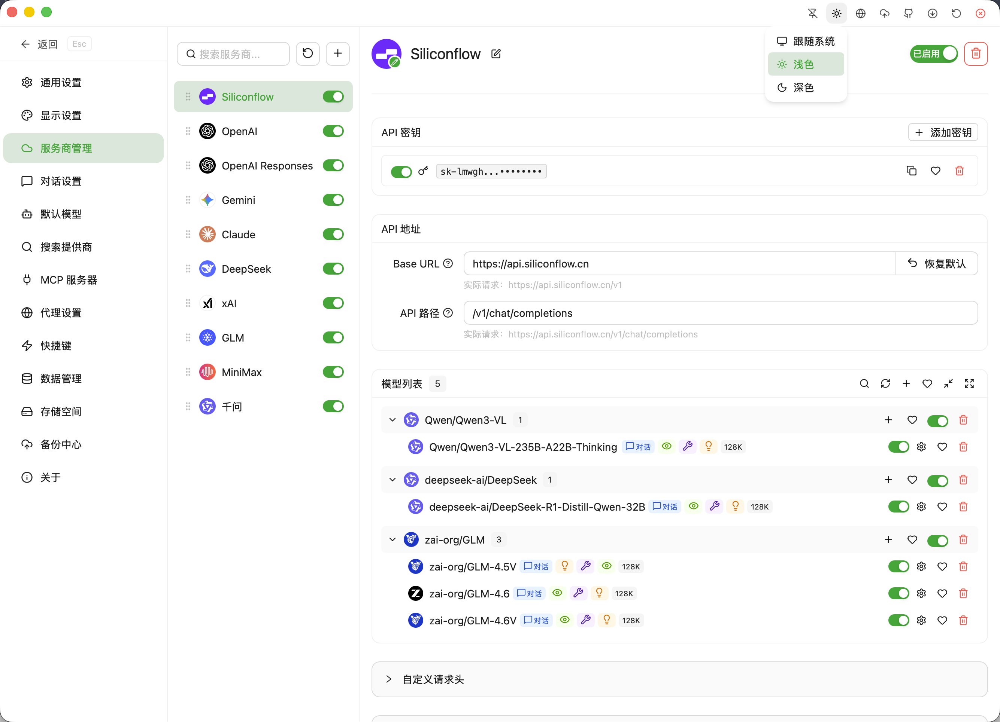
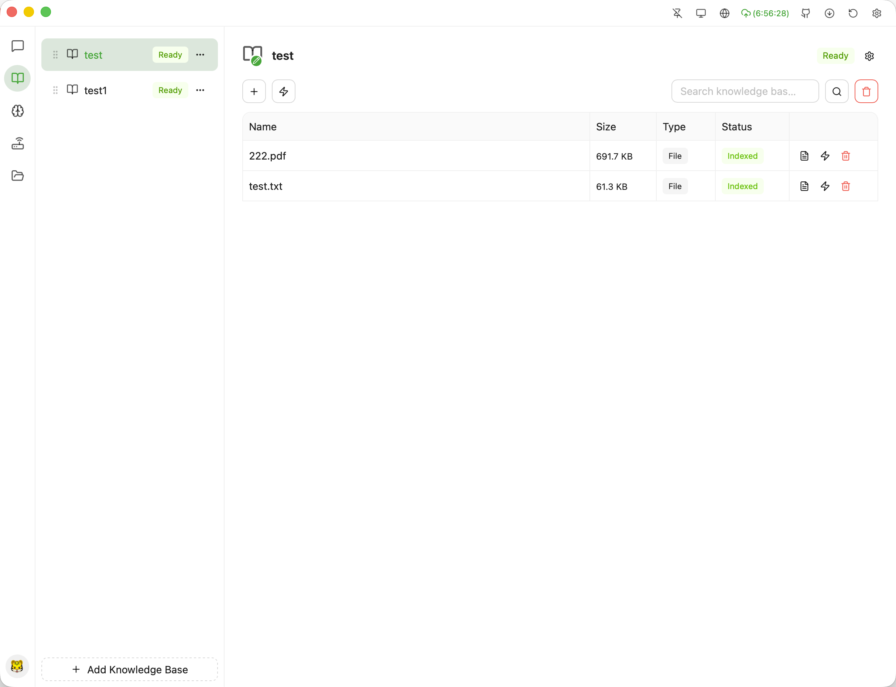
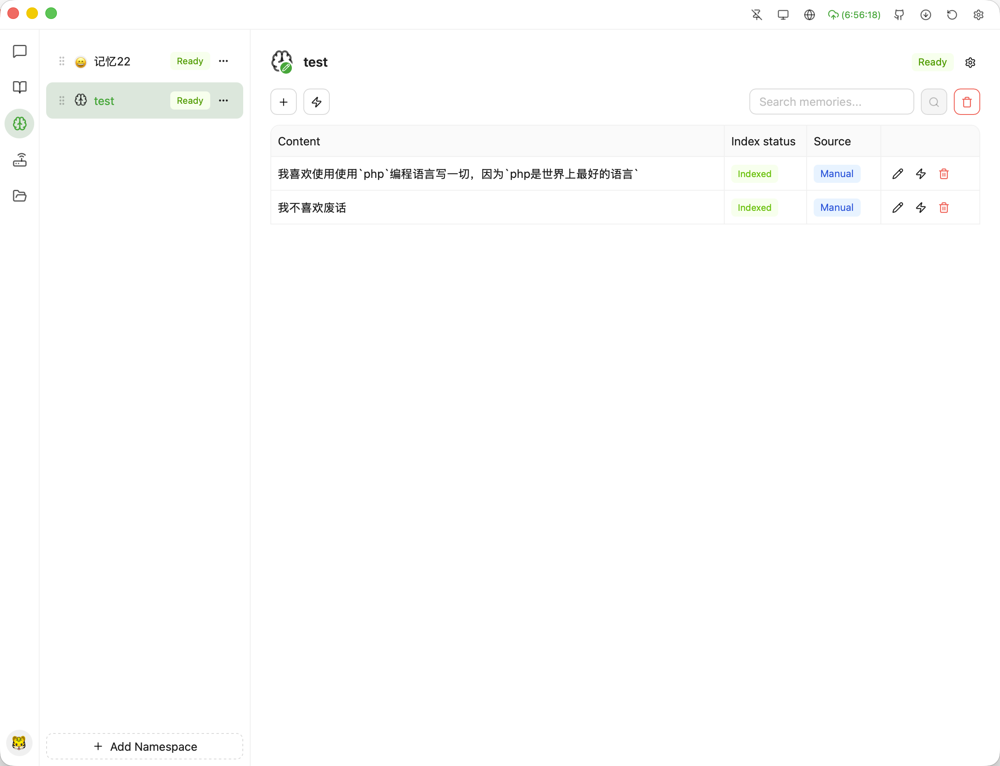
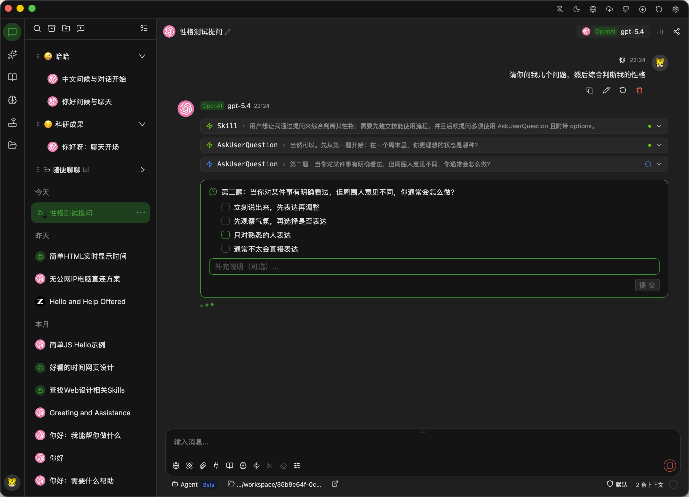
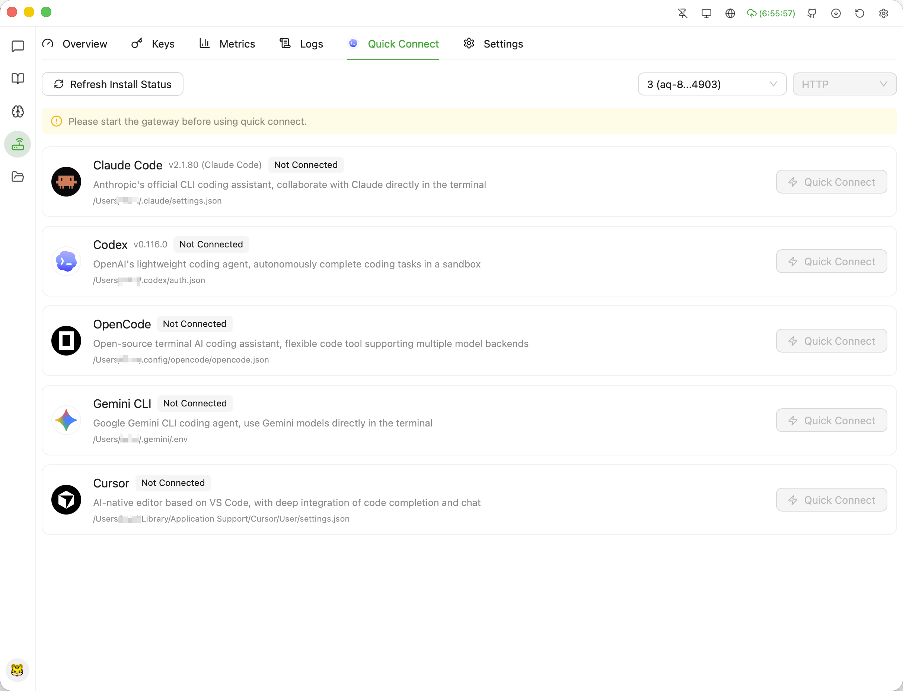
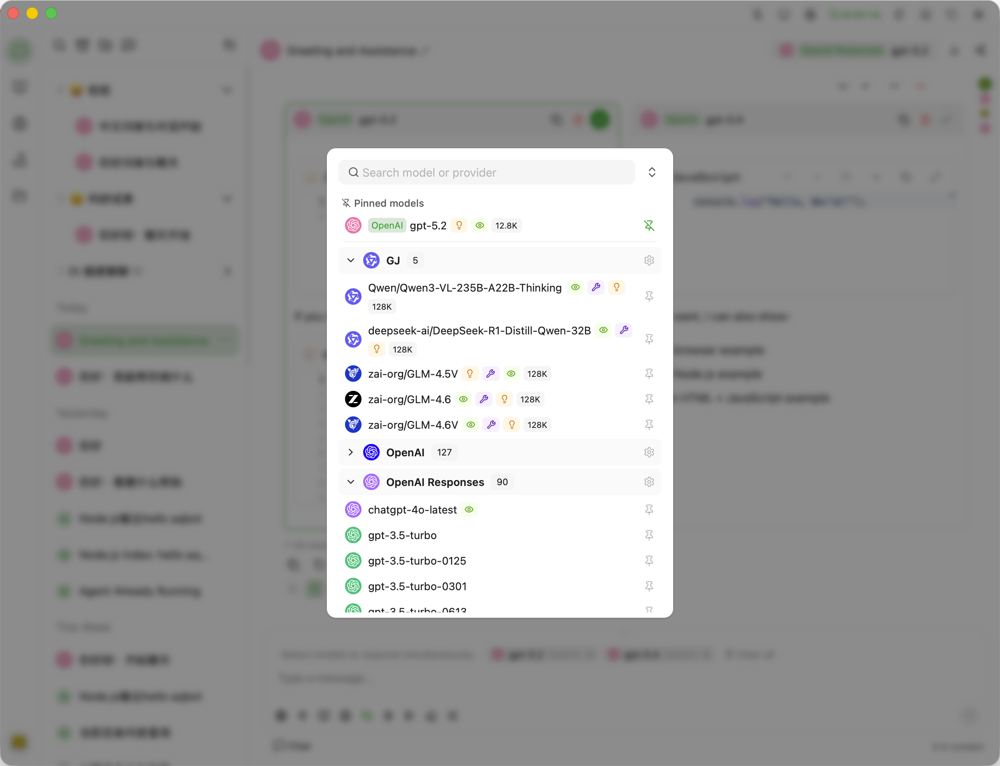
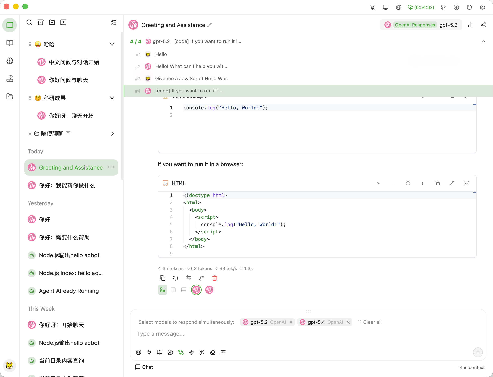
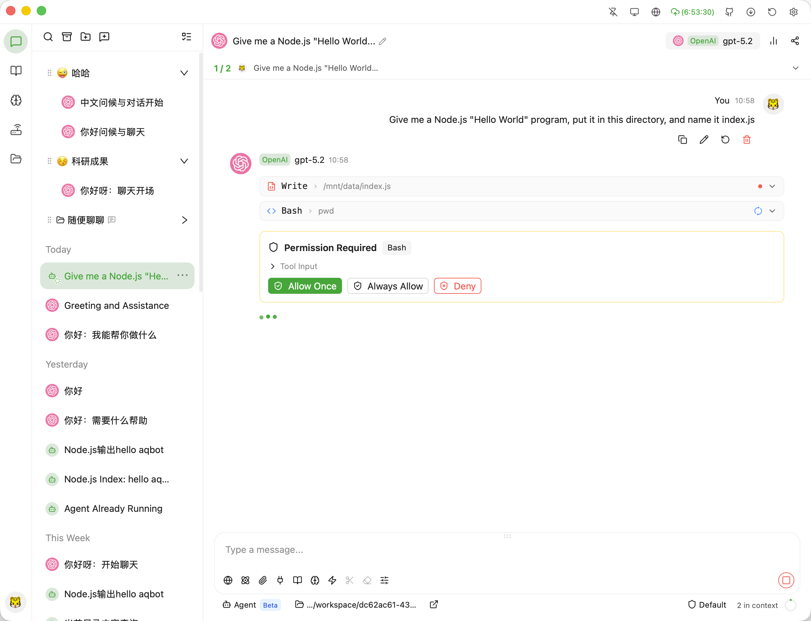
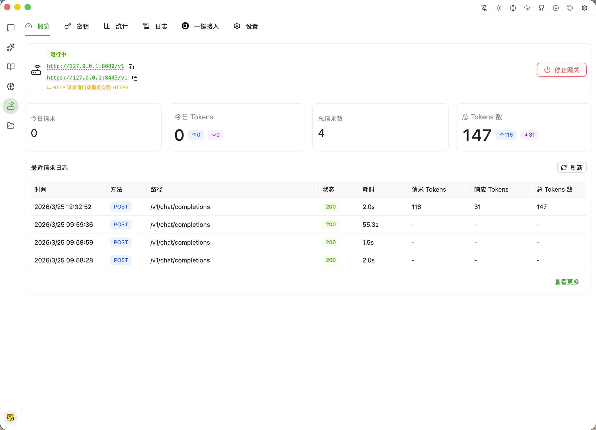

[简体中文](./README.md) | [繁體中文](./README-ZH-TW.md) | [English](./README-EN.md) | [日本語](./README-JA.md) | [한국어](./README-KO.md) | [Français](./README-FR.md) | [Deutsch](./README-DE.md) | [Español](./README-ES.md) | [Русский](./README-RU.md) | **हिन्दी** | [العربية](./README-AR.md)

[](https://github.com/wiseSpace-Desktop/wiseSpace)

<p align="center">
    <a href="https://www.producthunt.com/products/wisespace?embed=true&amp;utm_source=badge-featured&amp;utm_medium=badge&amp;utm_campaign=badge-wisespace" target="_blank" rel="noopener noreferrer"></a>
</p>

## स्क्रीनशॉट

| चैट चार्ट रेंडरिंग | प्रदाता और मॉडल |
|:---:|:---:|
|  |  |

| ज्ञान आधार | स्मृति |
|:---:|:---:|
|  |  |

| Agent - पूछताछ | API गेटवे वन-क्लिक एक्सेस |
|:---:|:---:|
|  |  |

| चैट मॉडल चयन | चैट नेविगेशन |
|:---:|:---:|
|  |  |

| Agent - अनुमति अनुमोदन | API गेटवे अवलोकन |
|:---:|:---:|
|  |  |

## विशेषताएँ

### चैट और मॉडल

- **मल्टी-प्रोवाइडर समर्थन** — OpenAI, Anthropic Claude, Google Gemini और सभी OpenAI-संगत APIs के साथ संगत
- **मॉडल प्रबंधन** — रिमोट मॉडल सूचियाँ लाएँ, पैरामीटर कस्टमाइज़ करें (तापमान, अधिकतम टोकन, Top-P, आदि)
- **मल्टी-की रोटेशन** — प्रत्येक प्रोवाइडर के लिए कई API कुंजियाँ कॉन्फ़िगर करें, दर सीमा दबाव वितरित करने के लिए स्वचालित रोटेशन के साथ
- **स्ट्रीमिंग आउटपुट** — फोल्ड करने योग्य थिंकिंग ब्लॉक के साथ रियल-टाइम टोकन-दर-टोकन रेंडरिंग
- **संदेश संस्करण** — मॉडल या पैरामीटर प्रभावों की तुलना करने के लिए प्रत्येक संदेश पर कई प्रतिक्रिया संस्करणों के बीच स्विच करें
- **वार्तालाप शाखाएँ** — किसी भी संदेश नोड से नई शाखाएँ बनाएँ, शाखाओं की साइड-बाय-साइड तुलना के साथ
- **वार्तालाप प्रबंधन** — पिन करें, संग्रहीत करें, समय-समूहीकृत प्रदर्शन और बल्क ऑपरेशन
- **वार्तालाप संपीड़न** — संदर्भ स्थान बचाने के लिए मुख्य जानकारी संरक्षित करते हुए लंबी बातचीत को स्वचालित रूप से संपीड़ित करें
- **मल्टी-मॉडल एक साथ प्रतिक्रिया** — एक साथ कई मॉडलों से एक ही प्रश्न पूछें, उत्तरों की साइड-बाय-साइड तुलना के साथ

### AI Agent

- **Agent मोड** — Agent मोड में स्विच करें, AI स्वायत्त रूप से बहु-चरणीय कार्य निष्पादित कर सकता है: फ़ाइलें पढ़ना/लिखना, कमांड चलाना, कोड विश्लेषण, और अधिक
- **तीन अनुमति स्तर** — डिफ़ॉल्ट (लिखने के लिए अनुमोदन आवश्यक), संपादन स्वीकार करें (फ़ाइल परिवर्तन स्वचालित रूप से स्वीकृत), पूर्ण पहुँच (कोई संकेत नहीं) — सुरक्षित और नियंत्रणीय
- **कार्य निर्देशिका सैंडबॉक्स** — Agent संचालन निर्दिष्ट कार्य निर्देशिका तक सख्ती से सीमित, अनधिकृत पहुँच को रोकता है
- **टूल अनुमोदन पैनल** — टूल कॉल अनुरोधों का रीयल-टाइम प्रदर्शन, प्रति-टूल समीक्षा, एक-क्लिक "हमेशा अनुमति दें", या अस्वीकार
- **लागत ट्रैकिंग** — प्रति सत्र रीयल-टाइम टोकन उपयोग और लागत सांख्यिकी

### सामग्री रेंडरिंग

- **Markdown रेंडरिंग** — कोड हाइलाइटिंग, LaTeX गणित सूत्र, तालिकाओं और कार्य सूचियों के लिए पूर्ण समर्थन
- **Monaco कोड एडिटर** — कोड ब्लॉक में Monaco Editor एम्बेड किया गया, सिंटैक्स हाइलाइटिंग, कॉपी और diff प्रीव्यू के साथ
- **आरेख रेंडरिंग** — Mermaid फ्लोचार्ट और D2 आर्किटेक्चर आरेख रेंडरिंग इनबिल्ट
- **Artifact पैनल** — कोड स्निपेट, HTML ड्राफ्ट, Markdown नोट्स और रिपोर्ट एक समर्पित पैनल में देखें
- **रियल-टाइम वॉयस चैट** — (जल्द आ रहा है) OpenAI Realtime API समर्थन के साथ WebRTC-आधारित रियल-टाइम वॉयस

### खोज और ज्ञान

- **वेब खोज** — Tavily, Zhipu WebSearch, Bocha और अधिक के साथ एकीकृत, उद्धरण स्रोत एनोटेशन के साथ
- **स्थानीय ज्ञान आधार (RAG)** — कई ज्ञान आधारों का समर्थन करता है; स्वचालित पार्सिंग, चंकिंग और इंडेक्सिंग के लिए दस्तावेज़ अपलोड करें, बातचीत के दौरान प्रासंगिक अनुच्छेदों की सेमांटिक पुनर्प्राप्ति के साथ
- **स्मृति प्रणाली** — मल्टी-नेमस्पेस वार्तालाप स्मृति का समर्थन करता है, मैन्युअल प्रविष्टि या AI-संचालित ऑटो-एक्सट्रैक्शन के साथ (ऑटो-एक्सट्रैक्शन जल्द आ रहा है)
- **संदर्भ प्रबंधन** — फ़ाइल अनुलग्नक, खोज परिणाम, ज्ञान आधार अनुच्छेद, स्मृति प्रविष्टियाँ और टूल आउटपुट को लचीले ढंग से संलग्न करें

### टूल और एक्सटेंशन

- **MCP प्रोटोकॉल** — stdio और HTTP दोनों ट्रांसपोर्ट का समर्थन करने वाला पूर्ण Model Context Protocol कार्यान्वयन
- **इनबिल्ट टूल** — `@wisespace/fetch` जैसे तुरंत उपयोग के लिए तैयार इनबिल्ट MCP टूल
- **टूल एग्जीक्यूशन पैनल** — टूल कॉल अनुरोधों और वापसी परिणामों का दृश्य प्रदर्शन

### API गेटवे

- **स्थानीय API गेटवे** — OpenAI-संगत, Claude और Gemini इंटरफेस के लिए नेटिव समर्थन के साथ इनबिल्ट स्थानीय API सर्वर, किसी भी संगत क्लाइंट के लिए बैकएंड के रूप में उपयोग योग्य
- **API कुंजी प्रबंधन** — विवरण नोट के साथ एक्सेस कुंजियाँ उत्पन्न करें, रद्द करें और सक्षम/अक्षम करें
- **उपयोग विश्लेषण** — कुंजी, प्रोवाइडर और तारीख द्वारा अनुरोध वॉल्यूम और टोकन उपयोग विश्लेषण
- **SSL/TLS समर्थन** — इनबिल्ट सेल्फ-साइन्ड सर्टिफिकेट जनरेशन, कस्टम सर्टिफिकेट के समर्थन के साथ
- **अनुरोध लॉग** — गेटवे से गुजरने वाले सभी API अनुरोधों और प्रतिक्रियाओं की पूर्ण रिकॉर्डिंग
- **कॉन्फ़िगरेशन टेम्प्लेट** — Claude, Codex, OpenCode और Gemini जैसे लोकप्रिय CLI टूल के लिए प्री-बिल्ट एकीकरण टेम्प्लेट

### डेटा और सुरक्षा

- **AES-256 एन्क्रिप्शन** — API कुंजियाँ और संवेदनशील डेटा AES-256 के साथ स्थानीय रूप से एन्क्रिप्ट किए गए; मास्टर कुंजी 0600 अनुमतियों के साथ संग्रहीत
- **अलग डेटा डायरेक्टरी** — `~/.wisespace/` में एप्लिकेशन स्थिति; `~/Documents/wisespace/` में उपयोगकर्ता फाइलें
- **ऑटो बैकअप** — स्थानीय डायरेक्टरी या WebDAV स्टोरेज में अनुसूचित स्वचालित बैकअप
- **बैकअप पुनर्स्थापना** — ऐतिहासिक बैकअप से वन-क्लिक पुनर्स्थापना
- **वार्तालाप निर्यात** — बातचीत को PNG स्क्रीनशॉट, Markdown, सादे पाठ या JSON के रूप में निर्यात करें

### डेस्कटॉप अनुभव

- **थीम स्विचिंग** — डार्क/लाइट थीम जो सिस्टम प्राथमिकता का पालन करते हैं या मैन्युअल रूप से सेट किए जा सकते हैं
- **इंटरफेस भाषा** — सरलीकृत चीनी, पारंपरिक चीनी, अंग्रेजी, जापानी, कोरियाई, फ्रेंच, जर्मन, स्पेनिश, रूसी, हिंदी और अरबी के लिए पूर्ण समर्थन, सेटिंग्स में कभी भी स्विच करने योग्य
- **सिस्टम ट्रे** — बैकग्राउंड सेवाओं को बाधित किए बिना विंडो बंद होने पर सिस्टम ट्रे में छोटा करें
- **हमेशा ऊपर** — मुख्य विंडो को सभी अन्य विंडो के ऊपर रखें
- **ग्लोबल शॉर्टकट** — किसी भी समय मुख्य विंडो को बुलाने के लिए कस्टमाइज़ेबल ग्लोबल कीबोर्ड शॉर्टकट
- **ऑटो स्टार्ट** — सिस्टम स्टार्टअप पर वैकल्पिक लॉन्च
- **प्रॉक्सी समर्थन** — HTTP और SOCKS5 प्रॉक्सी कॉन्फ़िगरेशन
- **ऑटो अपडेट** — स्टार्टअप पर नए संस्करणों की स्वचालित जाँच और अपडेट के लिए संकेत

## प्लेटफॉर्म समर्थन

| प्लेटफॉर्म | आर्किटेक्चर |
|-----------|------------|
| macOS | Apple Silicon (arm64), Intel (x86_64) |
| Windows 10/11 | x86_64, arm64 |
| Linux | x86_64 (AppImage/deb/rpm), arm64 (AppImage/deb/rpm) |

## शुरू करना

[Releases](https://github.com/wiseSpace-Desktop/wiseSpace/releases) पेज पर जाएँ और अपने प्लेटफॉर्म के लिए इंस्टॉलर डाउनलोड करें।

## अक्सर पूछे जाने वाले प्रश्न

### macOS: "ऐप क्षतिग्रस्त है" या "डेवलपर को सत्यापित नहीं किया जा सकता"

चूँकि एप्लिकेशन Apple द्वारा साइन नहीं किया गया है, macOS निम्नलिखित में से एक संकेत दिखा सकता है:

- "wiseSpace" क्षतिग्रस्त है और इसे नहीं खोला जा सकता
- "wiseSpace" को नहीं खोला जा सकता क्योंकि Apple इसे दुर्भावनापूर्ण सॉफ़्टवेयर के लिए जाँच नहीं कर सकता

**समाधान के चरण:**

**1. "कहीं से भी" ऐप्स की अनुमति दें**

```bash
sudo spctl --master-disable
```

फिर **सिस्टम सेटिंग्स → गोपनीयता और सुरक्षा → सुरक्षा** पर जाएँ और **कहीं से भी** चुनें।

**2. क्वारंटाइन विशेषता हटाएँ**

```bash
sudo xattr -dr com.apple.quarantine /Applications/wiseSpace.app
```

> टिप: आप `sudo xattr -dr com.apple.quarantine ` टाइप करने के बाद टर्मिनल पर ऐप आइकन खींच सकते हैं।

**3. macOS Ventura और बाद के संस्करणों के लिए अतिरिक्त चरण**

उपरोक्त चरण पूरे करने के बाद, पहला लॉन्च अभी भी ब्लॉक हो सकता है। **सिस्टम सेटिंग्स → गोपनीयता और सुरक्षा** पर जाएँ, फिर सुरक्षा अनुभाग में **फिर भी खोलें** पर क्लिक करें। यह केवल एक बार किया जाना चाहिए।

## समुदाय
- [LinuxDO](https://linux.do)

## लाइसेंस

यह प्रोजेक्ट [AGPL-3.0](LICENSE) लाइसेंस के तहत लाइसेंस प्राप्त है।
