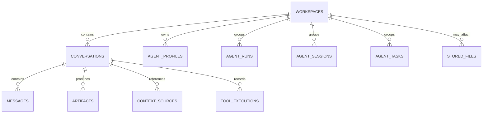

# wiseSpace Workspace Schema Draft

> 日期：2026-05-23
>
> 这份文档是 `Workspace First` 实施阶段的第一份落地设计稿，目标是把
> `workspace` 从概念和关系图推进到可执行的 schema 与 migration 方案。
>
> 关联文档：
> - `docs/project/ARCHITECTURE.md`
> - `docs/planning/workspace-scope-audit.md`
> - `docs/planning/workspace-implementation-checklist.md`
> - `docs/OPTIMIZATION_CHECKLIST.zh-CN.md`

---

## 1. 目标

这一阶段不直接重构所有业务逻辑，而是先建立稳定的数据库主骨架：

- 新增 `workspaces` 主实体
- 给 conversation 和 agent 相关记录补上 `workspace_id`
- 保留旧字段，先做兼容迁移
- 为下一阶段的 workspace 绑定表和 snapshot 投影铺路

核心原则：

- 先引入身份，再迁移行为
- 先兼容读写，再清理旧模型
- 先保证 chat 不受影响，再推进 workspace 化

---

## 2. 目标实体关系

目标关系如下：



解释：

- `workspace` 是长期容器
- `conversation` 是 `workspace` 内线程
- `agent_*` 记录按 `workspace` 分组
- `messages / artifacts / context_sources / tool_executions` 暂时仍保留 conversation 所属关系
- `stored_files` 建议先支持 `workspace_id` 可空，避免一次性强推所有文件归属逻辑

---

## 3. `workspaces` 表草案

建议新增主表：

```sql
CREATE TABLE workspaces (
  id TEXT PRIMARY KEY,
  slug TEXT NOT NULL UNIQUE,
  name TEXT NOT NULL,
  root_path TEXT NOT NULL,
  source TEXT NOT NULL DEFAULT 'conversation_backfill',
  description TEXT,
  created_at TEXT NOT NULL,
  updated_at TEXT NOT NULL
);
```

字段建议：

- `id`
  - 使用现有实体风格一致的字符串主键
- `slug`
  - 面向 UI 和 URL 风格标识，便于后续排序、检索和人类可读展示
- `name`
  - 用户可见名称
- `root_path`
  - workspace 对应的实际目录路径
  - 第一阶段允许保存绝对路径，和现有 agent / storage 路径模型兼容
- `source`
  - 标识来源，例如：
    - `conversation_backfill`
    - `manual_create`
    - `imported`
- `description`
  - 预留字段，可为空
- `created_at / updated_at`
  - 与现有表风格保持一致

约束建议：

- `slug` 唯一
- `root_path` 初期不强加唯一约束

原因：

- 旧数据回填阶段，路径和概念身份可能暂时不完全一一对应
- 等 backfill 和 canonical workspace 逻辑稳定后，再评估是否对 `root_path` 加唯一约束

---

## 4. 现有表字段增量

第一阶段建议仅新增字段，不删除旧字段。

### 4.1 `conversations`

新增：

```sql
ALTER TABLE conversations ADD COLUMN workspace_id TEXT;
```

用途：

- conversation 归属到 canonical workspace
- 保留现有 `workspace_snapshot_json` 和 `enabled_*` 字段作为兼容层

### 4.2 `agent_profiles`

新增：

```sql
ALTER TABLE agent_profiles ADD COLUMN workspace_id TEXT;
```

用途：

- 补足 profile 的规范归属
- 保留 `workspace_root` 作为运行时便捷字段

### 4.3 `agent_runs`

新增：

```sql
ALTER TABLE agent_runs ADD COLUMN workspace_id TEXT;
```

用途：

- 支撑 workspace 级运行历史
- 保留 `workspace_root`

### 4.4 `agent_sessions`

新增：

```sql
ALTER TABLE agent_sessions ADD COLUMN workspace_id TEXT;
```

用途：

- 让 session 不再只靠 `conversation_id` 和 `cwd` 识别归属
- `cwd` 继续保留为运行时状态

### 4.5 `agent_tasks`

新增：

```sql
ALTER TABLE agent_tasks ADD COLUMN workspace_id TEXT;
```

用途：

- 支撑 conversation 弱关联情况下的 workspace 级任务中心

### 4.6 `stored_files`

建议新增：

```sql
ALTER TABLE stored_files ADD COLUMN workspace_id TEXT;
```

用途：

- 为 Files 演进成 workspace 资产中心留出归属能力
- 保持可空，避免影响现有 conversation 附件流

---

## 5. 索引建议

第一阶段需要补的索引：

```sql
CREATE INDEX idx_conversations_workspace_id ON conversations(workspace_id);
CREATE INDEX idx_agent_profiles_workspace_id ON agent_profiles(workspace_id);
CREATE INDEX idx_agent_runs_workspace_id ON agent_runs(workspace_id);
CREATE INDEX idx_agent_sessions_workspace_id ON agent_sessions(workspace_id);
CREATE INDEX idx_agent_tasks_workspace_id ON agent_tasks(workspace_id);
CREATE INDEX idx_stored_files_workspace_id ON stored_files(workspace_id);
```

原因：

- workspace 首页、侧边栏、任务中心、历史记录都会按 `workspace_id` 查
- 没有索引的话，这条线一旦接到 UI 很容易出现卡顿

---

## 6. 回填策略

### 6.1 最保守方案

默认策略：

- 每个已有 `conversation` 回填出一个 `workspace`
- `workspace.root_path` 取现有 conversation workspace 目录
- `workspace.name` 默认来自 conversation 标题，若为空则用回退名称
- `workspace.slug` 由 `conversation_id` 或规范化标题生成

这样做的好处：

- 风险最低
- 不需要在第一阶段就判断多个 conversation 是否应该合并到同一 workspace
- 可先建立稳定身份，再逐步支持“多个 conversation 复用同一 workspace”

### 6.2 关联回填

回填顺序建议：

1. 遍历 `conversations`
2. 为每条 conversation 创建对应 workspace
3. 回写 `conversations.workspace_id`
4. 按 `conversation_id` 回填：
   - `agent_profiles.workspace_id`
   - `agent_runs.workspace_id`
   - `agent_sessions.workspace_id`
   - `agent_tasks.workspace_id`
5. 如果 `stored_files.conversation_id` 存在，再按 conversation 间接回填 `workspace_id`

### 6.3 暂不做的事

第一阶段不要做：

- 自动合并多个 conversation 到同一路径 workspace
- 自动清理旧 `enabled_*` 字段
- 自动把所有 artifact 升格成 workspace 资产

这些动作都适合放到第二阶段或单独 migration 里处理。

---

## 7. migration 拆分建议

不建议把所有工作塞进一个 migration。

### Migration A：结构引入

内容：

- 创建 `workspaces`
- 给现有表添加 `workspace_id`
- 创建相关索引

特点：

- 只做 schema 变更
- 不做复杂数据逻辑

### Migration B：数据回填

内容：

- 为历史 conversations 生成 canonical workspace
- 回填 conversation 和 agent 相关表的 `workspace_id`

特点：

- 关注数据迁移正确性
- 可以更容易单独测试和回滚分析

### Migration C：绑定表引入

下一阶段再做：

- `workspace_mcp_bindings`
- `workspace_knowledge_bindings`
- `workspace_memory_bindings`

这样能明显降低第一阶段风险。

---

## 8. repo / command 层跟进建议

结构落地后，代码层建议按这个顺序推进：

1. 新增 `workspace` entity 与 repo
2. conversation 创建时确保 canonical workspace 存在
3. agent profile / run / session / task 创建时带上 `workspace_id`
4. 暴露基础 workspace commands：
   - `list_workspaces`
   - `get_workspace`
   - `get_workspace_by_conversation`
5. 最后再替换 snapshot stub

这样可以避免“前端先依赖 workspace，但后端身份还没稳定”的问题。

---

## 9. 风险点

### 9.1 路径身份与实体身份混用

如果仍大量依赖 `workspace_root` 和 `cwd`，而不是统一走 `workspace_id`，后面很容易再次分裂。

建议：

- `workspace_id` 作为主身份
- `workspace_root / cwd` 作为运行时派生字段

### 9.2 conversation 兼容逻辑拖太久

如果 `enabled_*` 和 `workspace_snapshot_json` 长期不下沉，workspace 会一直停留在“看起来像主容器”。

建议：

- 第一阶段兼容保留
- 第二阶段明确开始搬迁绑定逻辑

### 9.3 文件归属过早复杂化

`stored_files` 很容易变成复杂点。

建议：

- 第一阶段只加 `workspace_id` 可空字段
- 先支持新流量写入
- 老逻辑保持兼容

---

## 10. 推荐结论

如果现在开始真正实施 `Workspace First`，最稳妥的下一步就是：

1. 先上 `workspaces` 表和 `workspace_id`
2. 用最保守回填方案建立 canonical workspace
3. 保留旧 conversation 字段作为兼容层
4. 再进入 workspace binding 和 snapshot projection 阶段

这条路线的优点是：

- 风险最低
- 不破坏普通 chat
- 能立即把 `workspace` 从“路径概念”推进成“数据库主实体”
