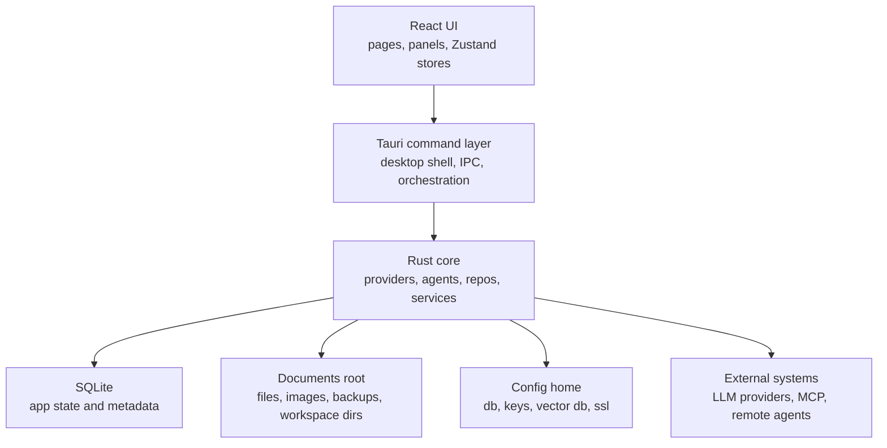
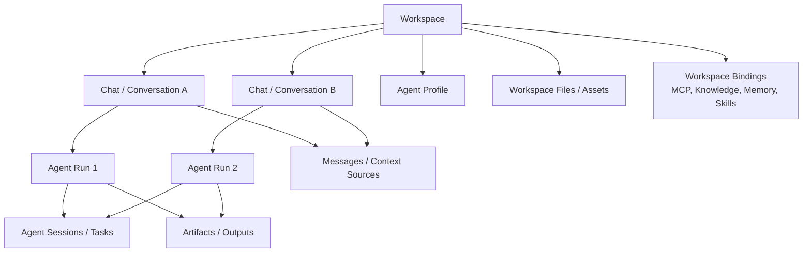

# wiseSpace Architecture

> Last updated: 2026-05-23
>
> Related docs:
> - `docs/README.md`
> - `docs/planning/workspace-scope-audit.md`
> - `docs/planning/workspace-implementation-checklist.md`
> - `docs/agent/local-agent-first-roadmap.md`

---

## 1. Positioning

wiseSpace is a local-first AI workspace for coding, research, files, memory,
and agent execution.

Its architecture is intentionally split across three layers:

- frontend workspace UI in React + Zustand
- desktop application shell and command surface in Tauri
- core runtime and persistence in Rust

The product already has strong capability breadth:

- conversations and branches
- local and external agent execution
- MCP integration
- knowledge and memory
- files, artifacts, and backups
- gateway and provider abstraction

The next architecture step is not "add more features first". It is to make the
existing capabilities align around a clearer product backbone:

- `workspace` as the long-lived context container
- `chat` as a thread inside a workspace
- `agent run` as an execution record inside a workspace

---

## 2. High-Level System Map



### Frontend

The frontend is responsible for:

- chat and workspace interaction
- file and artifact browsing
- context configuration
- agent run visibility
- user-facing state composition

Today, several stores still reflect feature-specific slices more strongly than a
single workspace-centric domain model. That is workable, but it is one reason
the architecture now needs a stronger workspace backbone.

### Tauri Command Layer

The Tauri layer acts as the desktop application boundary:

- exposes typed commands to the UI
- coordinates file access and OS integration
- bridges frontend flows into Rust services and repos

### Rust Core

The Rust core contains the durable application logic:

- entities and repos
- provider and gateway abstractions
- local and external agent runtime coordination
- storage path resolution
- persistence, backup, and recovery behavior

---

## 3. Storage Model

wiseSpace follows a dual-root storage policy.

### Config Home

Used for application internals:

- SQLite database
- encryption key
- vector database
- SSL certificates

### Documents Root

Used for user-visible assets:

- images
- files
- backups
- workspace directories

This split is important because the product is both:

- a desktop application with internal state
- a user-facing workspace with durable files and outputs

For the detailed policy, see repository guidance and storage-specific
implementation notes.

---

## 4. Core Domain Model

At a high level, the current product has these domain areas:

- conversation system
- agent execution system
- file and artifact system
- context system: MCP, knowledge, memory
- provider and gateway system

The main architecture challenge is how these areas should be organized.

Historically, `conversation` has carried too much responsibility. It has acted
as:

- a chat thread
- a context container
- a workspace-like holder of enabled MCP / knowledge / memory
- the anchor for files, artifacts, and agent execution

That worked for an earlier stage, but it now creates avoidable coupling.

---

## 5. Workspace, Chat, and Agent Relationship

This is the intended mental model going forward.

### Definitions

- `workspace`: the long-lived container for an ongoing body of work
- `chat` / `conversation`: a discussion thread inside that workspace
- `agent run`: a concrete execution inside that workspace, often initiated from
  a conversation

### Relationship Diagram



### What This Means

#### Workspace owns long-lived context

The workspace should be the default home for:

- working directory identity
- reusable files and promoted artifacts
- MCP bindings
- knowledge bindings
- memory bindings
- future extension bindings

#### Chat remains a first-class user experience

Ordinary chat does not go away.

A normal chat becomes:

- a lightweight thread inside a workspace
- the place where messages, branches, and local overrides live

This means the product can still support:

- quick Q&A
- translation and ideation
- debugging conversations
- architecture discussions

without forcing every thread to become a heavy agent workflow.

#### Agent run is an execution record, not the top-level container

Agent runs should be grouped by workspace so that:

- execution history is easier to recover
- artifacts and outputs stay connected to the same project context
- future subagent work has a stable parent scope

---

## 6. Current State vs. Target State

### Current State

Today, workspace behavior exists, but mostly through paths and snapshots:

- conversation workspace snapshot data
- conversation-level enabled MCP / knowledge / memory lists
- agent `workspace_root`
- agent session `cwd`
- filesystem workspace directories

This means the system is partially workspace-aware, but not yet modeled around a
first-class `workspace` entity.

### Target State

The target direction is:

```text
workspace
|- conversations
|- agent profiles
|- agent runs / sessions / tasks
|- workspace files and promoted artifacts
|- workspace MCP bindings
|- workspace knowledge bindings
|- workspace memory bindings
`- future extension bindings
```

That model keeps long-lived context reusable while allowing individual chats to
stay lightweight and independent.

---

## 7. Current Implementation Signals

Several parts of the codebase already hint at this direction:

- conversation workspace snapshot types exist on the frontend
- agent records already carry workspace path information
- workspace-oriented filesystem helpers already exist
- Tauri already exposes workspace snapshot command placeholders

These are useful building blocks, but they are not yet a complete product model.

The next step is to introduce:

- a real `workspaces` entity
- `workspace_id` on conversation and agent records
- workspace binding tables for reusable context

See:

- `docs/planning/workspace-scope-audit.md`
- `docs/planning/workspace-implementation-checklist.md`

---

## 8. Architectural Direction

The recommended sequence is:

1. make `workspace` a first-class entity
2. keep `chat` as the main thread experience inside a workspace
3. group agent execution by workspace
4. move reusable context bindings out of the conversation row
5. replace snapshot stubs with real workspace-backed projections

This gives wiseSpace a clearer backbone before adding more advanced features
such as subagents, richer extension systems, or deeper automation.
